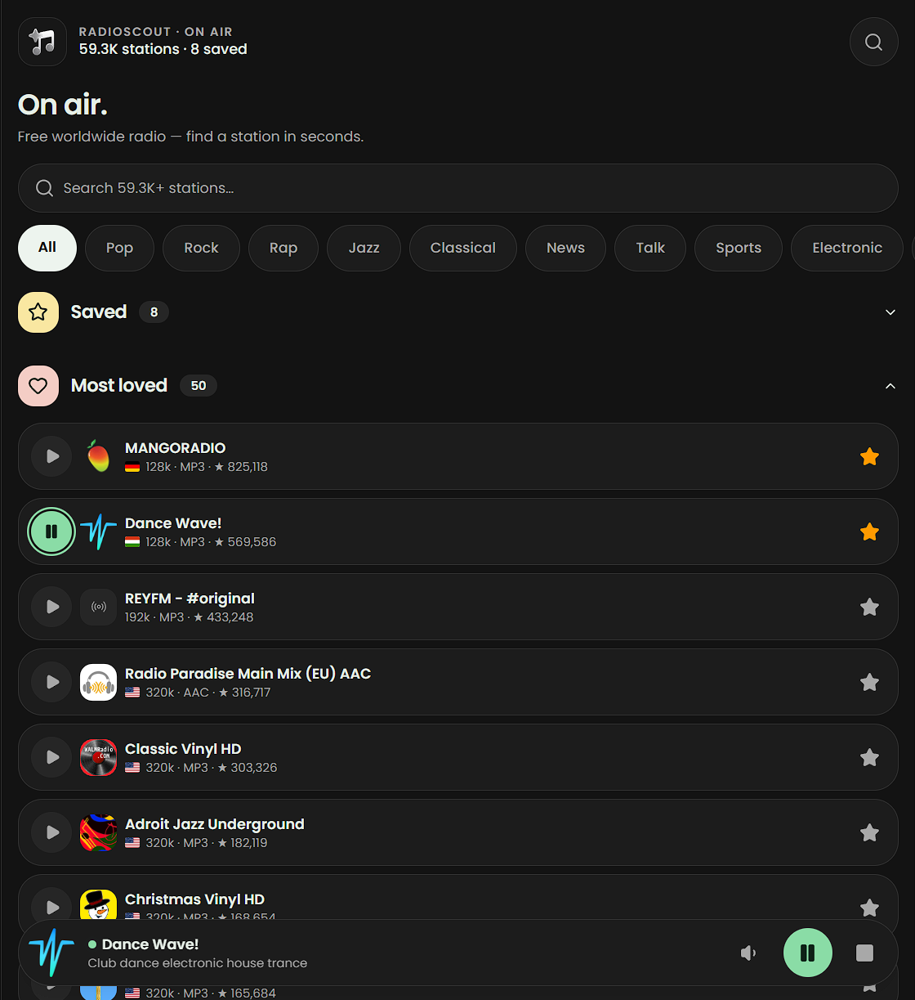

# Radio Scout

Live: **https://radioscout.pages.dev** — prerendered on Cloudflare Pages, hydrated on the client.



A free worldwide radio player that ships as static HTML from Cloudflare Pages — and as an Android APK from the same artifact. Type-safe routing, local-first IndexedDB state (favourites, history, prefs), persistent player dock with volume, backup export/import — all wired with Base UI and Tailwind.

## Features

Full tour: **[radioscout.pages.dev/features](https://radioscout.pages.dev/features)**.

- **Discover** — top 50 stations by votes, a Best of British shelf, full-text search with up to 50 results and shareable URLs, one-tap genre chips, recent searches, top-40 language quick picks, a flag-bearing country location filter, and a minimum-bitrate cutoff. Only playable `https://` streams are listed.
- **Library** — saved favourites with drag-to-reorder, recent plays, listening stats with trends, streaks and sortable top stations banked even if the app is killed, and station sheets with art, tags, flags, votes, and shareable links (`?station=<uuid>`, autoplay with `?play=` — see `docs/AGENTIC_PLAY.md`). Everything lives in on-device IndexedDB: no accounts, no sync, works offline.
- **Player** — persistent dock with gapless crossfade switching, volume plus per-station leveling, sleep timer with dock countdown, surprise shuffle, quick resume that reloads your last station, auto-reconnect with backoff, and lockscreen controls (MediaSession on web, notifications on Android).
- **Personal** — light, dark, or device-following theme with no flash, Mod+K Quick Find palette, a one-JSON radio backup that moves favourites, history, stats, volume, votes, and filters between browser and APK, and home-screen install as a PWA.
- **Android APK** — the same static build in a Capacitor shell: background audio service, zero-service OTA updates from GitHub Releases, theme-following status bar, edge-swipe and hardware back handling, and share-sheet backup export.

## What you get

Routing is file-based and type-safe with validation and intent preload. The build uses TanStack Start SSG; `crawlLinks` writes every route to `dist/client` for Pages (and the Capacitor shell — 8 pages). Client state goes through TanStack Query over Dexie (IndexedDB, isolated RadioDB for favourites/history) with a Zod-validated backup envelope. Favourites, history, votes and backup export/import work fully offline; hotkeys cover Mod+K. Primitives come from Base UI (Dialog, Select, Popover, Accordion, Tooltip, Sonner) in shadcn style without Radix. Styling is Tailwind v4 with `@theme` tokens. Icons are Lucide plus the inline glass-note brand mark, fonts are self-hosted Poppins with a metric fallback, and security and quality come from CSP, axe-core checks, and the Rust tools oxlint, oxfmt and the react-doctor plugin plus Fallow.

## Requirements

- Node 24+
- pnpm 10
- Android APK only: JDK 21 + Android cmdline-tools (`ANDROID_HOME`, see `docs/CAPACITOR_PLAN.md`)

## Tooling

**Build and bundle:** Vite 8 with Rolldown (`minify: oxc`, `target: esnext`, `cssCodeSplit: true`). Narrow `codeSplitting.groups` vendor chunks (react, tanstack, base-ui, lucide, sonner, fuse, zod, dexie, themes); `rollup-plugin-visualizer` writes `bundle-analysis-client.html`. `vite build` does the client + SSG build, then TanStack Start prerenders with `crawlLinks` + hash/query filter to `dist/client`.

**Types and styles:** TypeScript 7 with `tsc -b`, Tailwind CSS v4 through `@tailwindcss/vite` and `@theme` in `src/styles/index.css`. No `any` — strict.

**Lint and format (Rust):** `oxlint` (with `eslint-plugin-better-tailwindcss`, `eslint-plugin-react-hooks`, `eslint-plugin-react-refresh` and `eslint-plugin-react-doctor`) and `oxfmt`. Both run on Rust via `oxc`, so they are fast enough to keep on save. Config lives in `.oxlintrc.json` and `.oxfmtrc.json`.

**React Doctor:** The `react-doctor` OX plugin flags hydration and perf footguns — `new Date()` in render, `crypto.randomUUID()` in initial state, `useEffect(setState)` cascades, missing `aria-label`, `blur-2xl` and `transition-all`. See `.oxlintrc.json` for the full list.

**Testing:** Vitest 5 for unit tests in `tests/unit` plus `@testing-library/react` and `jest-dom`. Playwright 1.62 + `@axe-core/playwright` for e2e and a11y. `pnpm test` runs `vitest run && playwright test` so a single command covers the whole suite; `pnpm test:unit` and `pnpm test:e2e` still work alone. Test fixtures live in `tests/fixtures`.

**UI:** Base UI 1.7 as the primitive layer (`Dialog`, `Select`, `Tooltip` etc) styled with shadcn patterns. No Radix. Add a new primitive with `pnpm dlx shadcn@latest add <name> --yes` then rewire `@radix-ui/*` to `@base-ui/react/*`. Lucide React for icons.

**Quality:** Fallow (`fallow.toml` with `ignorePatterns`, `ignoreDependencies`, `regression.baseline`). `npx fallow audit --format json --quiet` is the gate (0 clean, 1 findings, 2 error).

## Quick start

```bash
git clone https://github.com/Double77x/radioscout.git
cd radioscout
pnpm install
pnpm dev        # http://localhost:8080
pnpm build      # prerenders to dist/
pnpm preview    # wrangler pages dev --port 8788
```

`pnpm dev` starts the Vite dev server with HMR. `pnpm build` runs `vite build && tsc -b` and crawls links to emit static HTML for every route into `dist/client`.

## For agents

This repo is set up to be read top-down by an agent. Start here:

1. `docs/ARCHITECTURE.md` — system design, routing, SSG lifecycle, native shell
2. `docs/TECH_STACK.md` — exact versions and why each piece was chosen
3. `docs/CODING_STANDARDS.md` — state rules (Query over Dexie, Router for URL state), no `useEffect` fetch, composition over inheritance
4. `docs/STYLE_GUIDE.md` — Tailwind tokens and layout zones
5. `src/lib/radio/store.ts` + `src/hooks/use-radio.ts` — example Query + Dexie flow
6. `src/components/radio/StationSkeleton.tsx` — geometry-matched loading skeletons
7. `src/components/scout/SwipeBack.tsx` + `src/lib/animated-back.ts` — gesture + OS-back coordination pattern
8. `docs/AGENTIC_PLAY.md` — agentic `?play=` URL contract, alias table, DOM hooks, Tier 2/3 expansion path

Quality gates before you open a PR:

```bash
pnpm lint                 # oxlint
pnpm format               # oxfmt
npx tsc -b --noEmit       # typecheck
pnpm build                # must prerender 8 pages
npx fallow audit --format json --quiet 2>/dev/null
# 0 = clean, 1 = findings, 2 = error envelope
pnpm test:unit            # vitest
pnpm test                 # playwright + axe
```

`fallow.toml` holds the baseline for `dead-code`, `dupes` and `health`. Use `fallow dead-code --trace src/file:export` before deleting a flagged export — Tailwind and oxlint plugins are false positives. See `docs/CODING_STANDARDS.md#15`.

React Doctor runs as an oxlint plugin (`eslint-plugin-react-doctor`). It flags hydration mismatches (`new Date()` in render, `randomUUID` in initial state, `useEffect(setState)`), missing labels, and large blur animations. Check `.oxlintrc.json` for the active rules.

## Project structure

```
src/
  components/
    NativeShell.tsx  Capacitor bootstrap (status bar, splash, Android back, OTA check) — no-op on web
    scout/     AppShell (frame + PlayerDock), SettingsMenu (data + style), SwipeBack (edge gesture)
    radio/     StationCard/Skeleton, StationArt, CountryFlag, SavedStations, PlayerDock, StationDetailSheet, RadioHeader
    layout/    LegalLayout, Prose
    shared/    StateShell (error/404 shells)
    ui/        Base UI primitives (accordion, badge, button, input, popover, select, sonner, tooltip)
    CommandPalette.tsx, RootDocument.tsx, Logo.tsx, …
  data/        navigation (single source for nav + palette), legal, station-aliases (agentic `?play=` aliases)
  hooks/       use-radio, use-player (Query + Dexie), use-station-detail, use-persistent-state
                and use-is-client
  lib/         radio/ (api, store, prefs, backup, votes, genres, ota), files,
                format, capacitor, focus-radio-search, animated-back, site, utils
  pages/       Home, legal pages, Changelog
  routes/      __root (head + fonts + NativeShell), index, legal (lazy splits except index)
  styles/      index.css (@theme tokens + keyframes), fonts.css
tests/
  unit/        vitest suites mirroring src (+ fixtures/)
  *.spec.ts    Playwright e2e + a11y
public/
  _headers     CSP + cache policy for /assets and /fonts
  sitemap.xml  generated via scripts/generate-sitemap.js
  site.webmanifest + icons  PWA shell (no service worker yet)
scripts/       generate-sitemap, generate-icons, generate-native-assets, cap-version, publish-ota, capture-*
capacitor.config.ts  Android shell on dist/client (`pnpm build:android:apk` / `build:android:aab`)
android/             committed native shell (local outputs gitignored)
```

## Deploy

Cloudflare Pages expects `dist/client`:

```bash
pnpm build
wrangler pages deploy dist/client
```

`wrangler.toml` sets `pages_build_output_dir = "dist/client"`. `_headers` sets 1-year immutable for `/assets/*` and `/fonts/*`, `must-revalidate` for HTML/CSS.

OTA updates for sideloaded APKs ship with zero services: `pnpm ota:publish` builds, zips and attaches the bundle to a GitHub Release and registers it in `public/ota/<channel>.json` — commit + push to go live. See `scripts/publish-ota.mjs`.

## Android (Capacitor)

The same `dist/client` artifact ships in the native shell:

```bash
pnpm build:android:apk   # debug APK (build + sync + version + assembleDebug)
pnpm build:android:aab   # release bundle
```

`cap:version` syncs `package.json` into `versionName`/`versionCode`; `cap:assets` regenerates icons/splash. Never commit `capacitor.config.local.ts`.

## Missing a station?

Station lists come from [radio-browser.info](https://www.radio-browser.info), and only
playable entries are shown: the app filters out anything that isn't a working `https://`
stream (`filterPlayableStations` in `src/lib/radio/types.ts`). Plain-`http://` streams can
never load from a secure page or the APK WebView — Chrome auto-upgrades them to `https://`
(where legacy stream edges abort TLS) — so they are hidden rather than left broken. Saved
favourites are kept and explain why they won't play if their stream goes HTTP-only.

If a station is missing, add it to the directory and it surfaces automatically:

1. Find the station's current `https://` stream URL (Bauer stations moved from
   `stream-*.planetradio.co.uk` to `stream-*.hellorayo.co.uk` / `live-*.sharp-stream.com` —
   the web player's network tab has it). Strip session tracking params
   (`permutiveid`, `listenerid`, `amsparams`, `___cb`); keep `direct=true`, `skey`,
   `playerid`, `rp_source`.
2. Confirm it serves audio: it should return `200` with an `audio/*` content type.
   (Pasting it in the address bar may offer a download — that says nothing about
   in-app playback; the `<audio>` element decodes it fine.)
3. Submit it at [radio-browser.info/add](https://www.radio-browser.info/add) with a name,
   `https://` favicon (the station site's `og:image` works), codec, country/language, and
   lowercase comma-separated tags (e.g. `rock,adult contemporary,indie,pop`).

### Station works over https but isn't listed?

Some stations register an `http://` stream address but serve the exact same
audio over `https://`. RadioScout keeps a verified allowlist of those hosts
(`HTTPS_UPGRADE_HOSTS` in `src/lib/radio/types.ts`) — anything unverified
stays hidden so nobody lands on a dead row.

If you know a station that upgrades cleanly:

1. Confirm the `https://` version of its stream URL actually plays audio
   (open it in a new tab — it should start streaming, not error).
2. [Open an issue](https://github.com/Double77x/radioscout/issues/new) with the
   station name, its radio-browser.info page (or station UUID), and both the
   `http://` and working `https://` stream URLs.
3. We'll re-verify it and add the host to the allowlist — the station then
   shows up in search and shelves automatically from the next release.

## Docs

- `docs/ARCHITECTURE.md` — routing, SSG, data flow, design system
- `docs/AGENTIC_PLAY.md` — agentic `?play=` contract + alias maintenance
- `docs/TECH_STACK.md` — versions and rationale
- `docs/CODING_STANDARDS.md` — hooks, state, perf, a11y, Fallow
- `docs/STYLE_GUIDE.md` — tokens and layout

## Contributing

We welcome issues and pull requests. Keep changes small, typed and lint-clean.

### Issues

Use the Bug report template for bugs and include steps to reproduce, what you expected, what happened, the browser, and a short `pnpm build` log if prerender failed. For features, use the Feature request template and describe the use case first; for larger work open an issue before you start so we do not pull in different directions. For questions, check `docs/ARCHITECTURE.md` and `docs/CODING_STANDARDS.md`, then try GitHub Discussions or `CTRL+K` → GitHub repository.

### Pull requests

1. Fork and branch from `main` — for example `git checkout -b feat/short-name`.
2. Keep the gates green:

   ```bash
   pnpm lint
   pnpm format
   npx tsc -b --noEmit
   pnpm build
   npx fallow audit --format json --quiet 2>/dev/null
   pnpm test:unit
   ```

3. Add tests for new hooks or anything in `src/lib`. Pure functions are the easiest to cover.
4. Update docs when you touch architecture, tokens or routing, and keep `AGENTS.md` aligned.
5. Push and open a PR against `main`. Describe what changed and why, how you tested it, and add screenshots for UI work. Link the issue if there is one.

We use [Conventional Commits](https://www.conventionalcommits.org/) (`feat:`, `fix:` …) so the changelog stays readable. Keep reviews focused on the code and be kind.

### Security

Report security issues privately via [GitHub security advisories](https://github.com/Double77x/radioscout/security/advisories/new) rather than opening a public issue. The current CSP lives in `public/_headers` and the policy page is `src/pages/Security.tsx`.

## License

MIT © [@Double77x](https://github.com/Double77x)

See [LICENSE](./LICENSE) for details.
