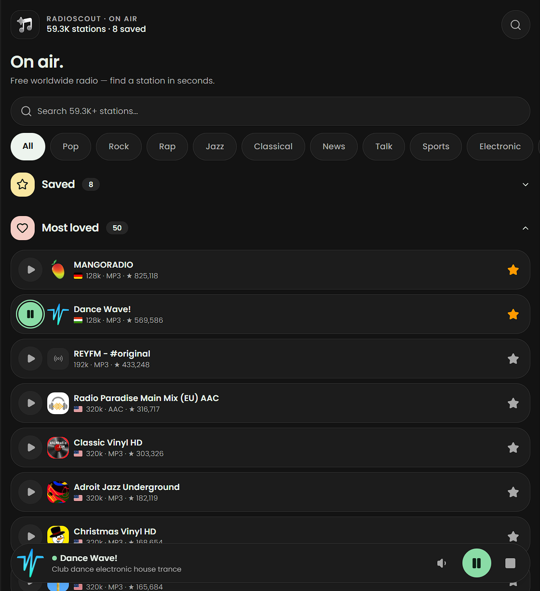

# Radio Scout

A free worldwide radio player. It ships as static HTML from Cloudflare Pages and
as an Android APK built from the same artefact.

Live: **[radioscout.pages.dev](https://radioscout.pages.dev)**



## Get the app

**In a browser.** Open the live site and install it to your home screen. It is a
plain static build, so it works offline once loaded and needs no account.

**On Android.** The APK is published on every GitHub release. Two ways in.

### Install with Obtainium [][obtainium]

<!-- regenerate the badge and its link with: pnpm obtainium:links -->

Or download an APK directly from
[the releases page](https://github.com/Double77x/radioscout/releases/latest).

[Obtainium](https://obtainium.imranr.dev/) installs and updates straight from a
project's own releases, so there is no store and no account. Tapping the badge
opens Obtainium's add screen, where you confirm the app before it is tracked.
If the badge does nothing, the link is being opened in a viewer that blocks
custom URL schemes, which the in-app browser in the GitHub app tends to do. Add
the source by hand instead: **Add app → GitHub**, then paste

```
https://github.com/Double77x/radioscout
```

Worth knowing before you switch source:

- Obtainium reads the GitHub API, and unauthenticated requests are capped at 60
  per hour per IP. Track many apps and you will want a fine-grained token under
  Obtainium's GitHub source settings.
- Updates install silently where Android allows it: Android 12 or later, and
  only for apps Obtainium installed itself. Otherwise you get a notification
  and tap to install.
- Obtainium, a manual APK install and F-Droid all sign with different keys, so
  moving between them means uninstalling first. Export your data from **Settings
  → Data backup** before you do. See `docs/FDROID_PLAN.md` and
  `docs/OBTAINIUM_PLAN.md`.

## Features

Full tour: **[radioscout.pages.dev/features](https://radioscout.pages.dev/features)**.

- **Discover** — top 50 stations by votes, a Best of British shelf, full-text
  search with up to 50 results and shareable URLs, one-tap genre chips, recent
  searches, top-40 language quick picks, a flag-bearing country filter, and a
  minimum-bitrate cutoff. Only playable `https://` streams are listed.
- **Library** — saved favourites with drag-to-reorder, recent plays, listening
  stats with trends, streaks and sortable top stations banked even if the app is
  killed, plus station sheets with art, tags, flags, votes and shareable links
  (`?station=<uuid>`, autoplay with `?play=` — see `docs/AGENTIC_PLAY.md`).
  Everything lives in on-device IndexedDB: no accounts, no sync, works offline.
- **Player** — persistent dock with gapless crossfade switching, volume plus
  per-station levelling, sleep timer with dock countdown, surprise shuffle, quick
  resume that reloads your last station, auto-reconnect with backoff, and
  lockscreen controls (MediaSession on web, notifications on Android).
- **Personal** — light, dark or device-following theme with no flash, a Mod+K
  Quick Find palette, home-screen install as a PWA, and a one-JSON radio backup
  that moves favourites, history, stats, volume, votes and filters between
  browser and APK.
- **Android** — the same static build in a Capacitor shell: background audio
  service, zero-service OTA updates from GitHub Releases, theme-following status
  bar, edge-swipe and hardware back handling, and share-sheet backup export.

## How it works

One static artefact serves both the website and the native apps.

- **Rendering.** File-based routes with validation and intent preload. The build
  uses TanStack Start SSG, and `crawlLinks` writes all 9 routes to `dist/client`
  for Cloudflare Pages and the Capacitor shell alike.
- **State.** TanStack Query over Dexie (IndexedDB), with favourites and history
  in an isolated `RadioDB` and a Zod-validated backup envelope. Favourites,
  history, votes and backup import/export all work offline. Hotkeys cover Mod+K.
- **UI.** Base UI 1.7 (Dialog, Select, Popover, Accordion, Tooltip, Sonner)
  styled in shadcn style, no Radix. Icons are Lucide plus the inline glass-note
  brand mark.
- **Styling.** Tailwind v4 with `@theme` tokens, and self-hosted Poppins with a
  metric-adjusted fallback.
- **Quality.** A CSP in `public/_headers`, axe-core checks, and the Rust tools
  oxlint, oxfmt and the react-doctor plugin, plus Fallow for dead code.

## Quick start

```bash
git clone https://github.com/Double77x/radioscout.git
cd radioscout
pnpm install
pnpm dev        # http://localhost:8080
pnpm exec vp run build  # prerenders to dist/
pnpm preview    # wrangler pages dev --port 8788
```

`pnpm dev` starts the Vite dev server with HMR. `pnpm exec vp run build` runs
the cached `build` task (`vp build` + `tsc -b` + sitemap + header policy) and
crawls links to emit static HTML for every route into `dist/client`.

## Requirements

- Node 26.8.2 (`.node-version`) and pnpm 12.8.1 (`packageManager`)
- Android builds only: JDK 21 and the Android cmdline-tools (`ANDROID_HOME`,
  see `docs/CAPACITOR_PLAN.md`)

## Tooling

| Area            | Choice                                                                                                                                                                                                                      |
| --------------- | --------------------------------------------------------------------------------------------------------------------------------------------------------------------------------------------------------------------------- |
| Build           | Vite 8 with Rolldown (`minify: oxc`, `target: esnext`, `cssCodeSplit: true`)                                                                                                                                                |
| Chunking        | Narrow `codeSplitting.groups` vendor chunks: react, tanstack, base-ui, lucide, sonner, fuse, zod, dexie, themes. `rollup-plugin-visualizer` writes `bundle-analysis-client.html`                                            |
| Types           | TypeScript 7 with `tsc -b`. No `any`                                                                                                                                                                                        |
| Styles          | Tailwind CSS v4 via `@tailwindcss/vite` and `@theme` in `src/styles/index.css`                                                                                                                                              |
| Lint and format | `oxlint` and `oxfmt`, both on Rust via `oxc`, so they are fast enough to keep on save. Config in `.oxlintrc.json` and `.oxfmtrc.json`                                                                                       |
| Hydration lint  | The `react-doctor` oxlint plugin flags `new Date()` in render, `crypto.randomUUID()` in initial state, `useEffect(setState)` cascades, missing `aria-label`, `blur-2xl` and `transition-all`. Full list in `.oxlintrc.json` |
| Unit tests      | Vitest 5 in `tests/unit`, with `@testing-library/react` and `jest-dom`                                                                                                                                                      |
| e2e and a11y    | Playwright with `@axe-core/playwright`. `pnpm test` runs both suites                                                                                                                                                        |
| UI primitives   | Base UI styled with shadcn patterns. Add one with `pnpm dlx shadcn@latest add <name> --yes`, then rewire `@radix-ui/*` to `@base-ui/react/*`                                                                                |
| Dead code       | Fallow, configured in `fallow.toml`. `npx fallow audit --format json --quiet` is the gate: 0 clean, 1 findings, 2 error envelope                                                                                            |

## Project structure

```
src/
  components/
    NativeShell.tsx  Capacitor bootstrap (status bar, splash, Android back, OTA check) — no-op on web
    scout/     AppShell (frame + PlayerDock), SettingsMenu (data + style), SwipeBack (edge gesture)
    radio/     StationCard/Skeleton, StationArt, CountryFlag, SavedStations, PlayerDock,
               StationDetailSheet, RadioHeader
    layout/    LegalLayout, Prose
    shared/    StateShell (error/404 shells)
    ui/        Base UI primitives (accordion, badge, button, input, popover, select, sonner, tooltip)
    CommandPalette.tsx, RootDocument.tsx, Logo.tsx, …
  data/        navigation (single source for nav + palette), legal,
               station-aliases (agentic `?play=` aliases)
  hooks/       use-radio, use-player (Query + Dexie), use-station-detail,
               use-persistent-state, use-is-client
  lib/         radio/ (api, store, prefs, backup, votes, genres, ota), files, format,
               capacitor, focus-radio-search, animated-back, site, utils
  pages/       Home, legal pages, Changelog
  routes/      __root (head + fonts + NativeShell), index, legal (lazy splits except index)
  styles/      index.css (@theme tokens + keyframes), fonts.css
tests/
  unit/        vitest suites mirroring src (+ fixtures/)
  *.spec.ts    Playwright e2e + a11y
public/
  _headers     CSP + cache policy for /assets and /fonts
  sitemap.xml  generated via scripts/generate-sitemap.js
  site.webmanifest + icons  PWA shell (no service worker yet)
distribution/
  obtainium/   listing config published to the Obtainium app directory
scripts/       generate-sitemap, generate-icons, generate-native-assets, cap-version,
               publish-ota, obtainium-links, capture-*
capacitor.config.ts  Android shell on dist/client
android/             committed native shell (local outputs gitignored)
```

## Deploy

Cloudflare Pages expects `dist/client`:

```bash
pnpm exec vp run build
wrangler pages deploy dist/client
```

`wrangler.toml` sets `pages_build_output_dir = "dist/client"`. `_headers` sets
1-year immutable for `/assets/*` and `/fonts/*`, and `must-revalidate` for HTML
and CSS.

OTA updates for sideloaded APKs ship with zero services. `pnpm ota:publish`
builds, zips and attaches the bundle to a GitHub Release, then registers it in
`public/ota/<channel>.json`. Commit and push to go live. See
`scripts/publish-ota.mjs`.

## Android (Capacitor)

The same `dist/client` artefact ships in the native shell:

```bash
pnpm build:android:apk   # debug APK (build + sync + version + assembleDebug)
pnpm build:android:aab   # release bundle
```

`cap:version` syncs `package.json` into `versionName` and `versionCode`.
`cap:assets` regenerates icons and splash. Never commit
`capacitor.config.local.ts`.

Release APKs come from tagging: `v*` builds a keystore-signed APK, attaches it
to the GitHub Release, and publishes a matching OTA bundle. See
`docs/CAPACITOR_PLAN.md` for the signing drill.

The Obtainium listing lives at
`distribution/obtainium/io.github.double77x.radioscout.json` and reuses the
F-Droid one-liner for its description. Run `pnpm obtainium:links` to regenerate
the badge block above, or `pnpm obtainium:links --check` to confirm the README
and the listing description have not drifted apart.

## Missing a station?

Station lists come from [radio-browser.info](https://www.radio-browser.info), and
only playable entries are shown. The app filters out anything that is not a
working `https://` stream (`filterPlayableStations` in
`src/lib/radio/types.ts`). A plain `http://` stream can never load from a secure
page or the APK WebView, because Chrome auto-upgrades it to `https://` and the
legacy stream edges abort TLS, so those rows are hidden rather than left broken.
Saved favourites are kept and explain why they will not play if their stream goes
HTTP-only.

To add a station, submit it to the directory and it surfaces automatically:

1. Find the station's current `https://` stream URL. Bauer stations moved from
   `stream-*.planetradio.co.uk` to `stream-*.hellorayo.co.uk` or
   `live-*.sharp-stream.com`, and the web player's network tab has it. Strip
   session tracking params (`permutiveid`, `listenerid`, `amsparams`, `___cb`)
   and keep `direct=true`, `skey`, `playerid`, `rp_source`.
2. Confirm it serves audio: a `200` with an `audio/*` content type. Pasting it in
   the address bar may offer a download, which says nothing about in-app
   playback. The `<audio>` element decodes it fine.
3. Submit it at [radio-browser.info/add](https://www.radio-browser.info/add) with
   a name, an `https://` favicon (the station site's `og:image` works), codec,
   country or language, and lowercase comma-separated tags such as
   `rock,adult contemporary,indie,pop`.

### Works over https but is not listed?

Some stations register an `http://` stream address and serve the same audio over
`https://`. RadioScout keeps a verified allowlist of those hosts
(`HTTPS_UPGRADE_HOSTS` in `src/lib/radio/types.ts`). Anything unverified stays
hidden, so nobody lands on a dead row.

If you know a station that upgrades cleanly:

1. Confirm the `https://` version of its stream URL actually plays audio. Open it
   in a new tab; it should start streaming rather than error.
2. [Open an issue](https://github.com/Double77x/radioscout/issues/new) with the
   station name, its radio-browser.info page or station UUID, and both the
   `http://` and the working `https://` stream URLs.
3. We re-verify it and add the host to the allowlist, and the station then shows
   up in search and on the shelves from the next release.

## For agents

This repo is meant to be read top-down. Start here:

1. `docs/ARCHITECTURE.md` — system design, routing, SSG lifecycle, native shell
2. `docs/TECH_STACK.md` — exact versions and why each piece was chosen
3. `docs/CODING_STANDARDS.md` — state rules (Query over Dexie, Router for URL
   state), no `useEffect` fetch, composition over inheritance
4. `docs/STYLE_GUIDE.md` — Tailwind tokens and layout zones
5. `src/lib/radio/store.ts` and `src/hooks/use-radio.ts` — example Query + Dexie
   flow
6. `src/components/radio/StationSkeleton.tsx` — geometry-matched loading
   skeletons
7. `src/components/scout/SwipeBack.tsx` and `src/lib/animated-back.ts` — gesture
   and OS-back coordination
8. `docs/AGENTIC_PLAY.md` — the agentic `?play=` URL contract, alias table, DOM
   hooks and expansion path

Gates to pass before opening a pull request:

```bash
pnpm lint                            # vp lint (oxlint)
pnpm format                          # vp fmt
npx tsc -b --noEmit                  # typecheck
pnpm exec vp run build               # must prerender 9 routes
npx fallow audit --format json --quiet 2>/dev/null
# 0 = clean, 1 = findings, 2 = error envelope
pnpm test:unit                       # vp test (vitest)
pnpm test                            # playwright + axe
```

`fallow.toml` holds the baseline for `dead-code`, `dupes` and `health`. Run
`fallow dead-code --trace src/file:export` before deleting a flagged export; the
Tailwind and oxlint plugins produce false positives. See
`docs/CODING_STANDARDS.md#15`.

## Docs

- `docs/ARCHITECTURE.md` — routing, SSG, data flow, design system
- `docs/AGENTIC_PLAY.md` — agentic `?play=` contract and alias maintenance
- `docs/TECH_STACK.md` — versions and rationale
- `docs/CODING_STANDARDS.md` — hooks, state, performance, a11y, Fallow
- `docs/STYLE_GUIDE.md` — tokens and layout
- `docs/ROADMAP.md` — what is planned next
- `docs/CAPACITOR_PLAN.md` — native shell, signing, release workflow
- `docs/NATIVE_AUDIO_PLAN.md` — the Media3 foreground-service player
- `docs/FDROID_PLAN.md` — F-Droid recipe, reproducible builds, listing metadata
- `docs/OBTAINIUM_PLAN.md` — Obtainium listing config and its release-layout
  hazards

## Contributing

Issues and pull requests are both welcome. Keep changes small, typed and
lint-clean.

### Issues

Use the bug report template and include the steps to reproduce, what you
expected, what happened, the browser, and a short `pnpm exec vp run build` log if prerender
failed. For features, use the feature request template and describe the use case
first. For larger work, open an issue before you start so we do not pull in
different directions. For questions, check `docs/ARCHITECTURE.md` and
`docs/CODING_STANDARDS.md`, then try GitHub Discussions or `CTRL+K` →
GitHub repository.

### Pull requests

1. Fork and branch from `main`, for example `git checkout -b feat/short-name`.
2. Keep the gates green:

   ```bash
   pnpm lint
   pnpm format
   npx tsc -b --noEmit
   pnpm exec vp run build
   npx fallow audit --format json --quiet 2>/dev/null
   pnpm test:unit
   ```

3. Add tests for new hooks or anything in `src/lib`. Pure functions are the
   easiest to cover.
4. Update the docs when you touch architecture, tokens or routing, and keep
   `AGENTS.md` aligned.
5. Push and open a pull request against `main`. Say what changed and why, how you
   tested it, and add screenshots for UI work. Link the issue if there is one.

We use [Conventional Commits](https://www.conventionalcommits.org/) (`feat:`,
`fix:` and so on) so the changelog stays readable. Keep reviews focused on the
code and be kind.

### Security

Report security issues privately through
[GitHub security advisories](https://github.com/Double77x/radioscout/security/advisories/new)
rather than opening a public issue. The current CSP lives in `public/_headers`
and the policy page is `src/pages/Security.tsx`.

## License

MIT © [@Double77x](https://github.com/Double77x)

See [LICENSE](./LICENSE) for details.

<!-- Kept out of the heading so the deep link does not clutter it. -->

[obtainium]: https://apps.obtainium.imranr.dev/redirect?r=obtainium://app/%7B%22id%22%3A%22io.github.double77x.radioscout%22%2C%22url%22%3A%22https%3A%2F%2Fgithub.com%2FDouble77x%2Fradioscout%22%2C%22author%22%3A%22Double77x%22%2C%22name%22%3A%22RadioScout%22%7D
